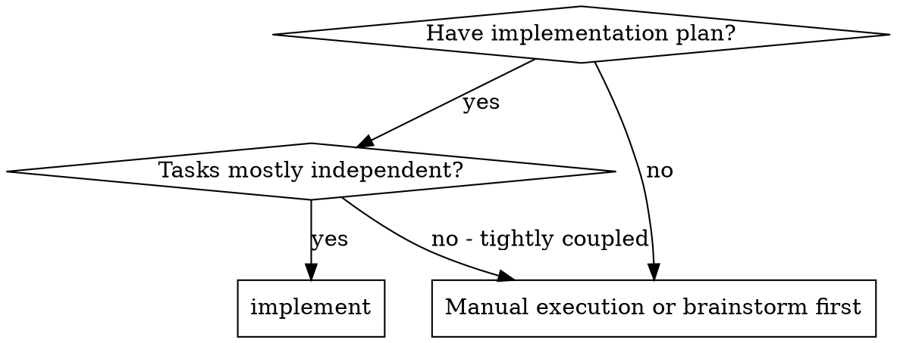

# When to Use, and a Worked Example

Orientation and one full run of the dispatch loop. Referenced from
[independent-review.md](independent-review.md) — the run below is that procedure.
The `self-review` path's shape is in [self-review.md](self-review.md) instead.

## Contents
- When to use this skill, and what the approach costs
- Example workflow: two tasks, one fix round, final review

## When to Use



**What this approach gives you:**
- Same session (no context switch)
- Fresh subagent per task (no context pollution)
- Review after each task (spec compliance + code quality), broad review at the end
- Faster iteration (no human-in-loop between tasks)

## Example Workflow

```
You: I'm using the cue-dev:implement skill to execute the plan.

[Prerequisite check: .cue/dev/PROJ-142/plan.md and outcome.md both present]
[Setup: worktree verified]
[Read plan file once: .cue/dev/PROJ-142/plan.md]
[Resolve workspace: <cue>/sdd-workspace .cue/dev/PROJ-142/plan.md]
[Create todos for all tasks]

Task 1: Hook installation script

[Run <cue>/task-brief for Task 1; dispatch implementer with brief + report paths + context]

Implementer: "Before I begin - should the hook be installed at user or system level?"

You: "User level (~/.config/cue/hooks/)"

Implementer: [Later]
  - Implemented install-hook command
  - Added tests, 5/5 passing
  - Self-review: Found I missed --force flag, added it
  - Committed

[Run <cue>/review-package PLAN_FILE BASE HEAD; dispatch task reviewer with the printed path]
Task reviewer: Spec ✅ - all requirements met, nothing extra.
  Strengths: Good test coverage, clean. Issues: None. Task quality: Approved.

[outcome.md: "- 1 · unrecorded" → "- 1 · d4e5f6a · as-planned"; commit it:
 git commit -m "chore: record task 1 — PROJ-142"]

Task 2: Recovery modes

[Run <cue>/task-brief for Task 2; dispatch implementer with brief + report paths + context]

Implementer: [No questions]
  - Added verify/repair modes
  - 8/8 tests passing
  - Committed

[Run <cue>/review-package PLAN_FILE BASE HEAD; dispatch task reviewer with the printed path]
Task reviewer: Spec ❌:
  - Missing: Progress reporting (spec says "report every 100 items")
  Issues (Important): Magic number (100)

[Fix round 1: resume the implementer with both findings]
Implementer: Added progress reporting, extracted PROGRESS_INTERVAL constant.
  Re-ran test/recovery.test.js — 10/10 passing. Fix report appended.

[Run <cue>/review-package PLAN_FILE FIX_BASE HEAD; dispatch scoped re-review]
Re-reviewer: Missing progress reporting — ADDRESSED (src/recovery.js:41).
  Magic number — ADDRESSED (src/recovery.js:7). New breakage: none.
  Verdict: all findings addressed.

[outcome.md: "- 2 · b7c8d9e · as-planned"; commit it]
  — both review findings were fixed, so it is as-planned. The findings
    themselves leave no trace: the code already matches the plan.

...

[After all tasks]
[Run <cue>/review-package PLAN_FILE MERGE_BASE HEAD; dispatch final code-reviewer, most capable model]
Final reviewer: All requirements met. Deferred minors triaged: none block merge.

[Back in SKILL.md, "Closing the record":
 outcome.md: write "## Summary", run <cue>/evidence PROJ-142 and answer its ask
 line, then fill the two header fields in place — they are two separate lines
 and stay two separate lines:
     checked-by: independent-review
     evidence:   red-output
 commit. The workspace stays; /cue-dev:finish removes it]
[Run <cue>/verify PROJ-142 --stage implement → ok]
[Run <cue>/notice and reproduce its output verbatim — the box below is that output]

━━━ IMPLEMENT done ━━━━━━━━━━━━━━━━━━━━━━━━━━━━

  key       PROJ-142
  tasks     8 (deviated 1 · skipped 0)
  commits   a1b2c3d..f0e9d8c
  checked   independent-review · red-output
  artifact  .cue/dev/PROJ-142/outcome.md

  next      /cue-dev:finish
  rewind    /cue-dev:redo implement
━━━━━━━━━━━━━━━━━━━━━━━━━━━━━━━━━━━━━━━━━━━━━━━
```

**The box above is `scripts/notice`'s output, not a drawing.** It is worth saying
because this example carried a hand-made one for a long time, and it was wrong in
the two ways the real rules exist to prevent: the KEY sat *in the title*
(`IMPLEMENT done · PROJ-142`), which `notice` refuses outright — the title is a
closed set and the KEY is a body line, because it is the longest and most variable
string in the block and the title is what fixes the frame's width. And the `key`
and `optional` lines were simply missing, so the example modelled a box narrower
than the one [SKILL.md](SKILL.md) tells you to print.
